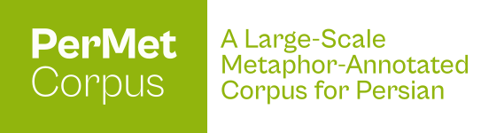

<p align="center">
  
</p>

# PerMet: A Large-Scale Metaphor-Annotated Corpus for Persian


[](https://universaldependencies.org/ext-format.html)
[](https://doi.org/10.5281/zenodo.XXXXXXX)

PerMet is a large-scale and register-diverse metaphor-annotated corpus for Persian developed to support corpus-linguistic and NLP research on metaphor. The corpus is annotated following the [Metaphor Identification Procedure Vrije Universiteit (MIPVU)](https://benjamins.com/catalog/celcr.14), with adaptations for Persian. 

---

## 🔎 Corpus Overview

- **Total size:** ~120,000 tokens
- **Lexical units (LUs):** ~99,000
- **Registers:** Academic, News, Fiction, Social Media, Spoken Discourse
- **Metaphor density:** 13.1% of LUs
- **Inter-annotator agreement:** κ = 0.952

---

## 📂 Repository Structure

```
PerMet/
├── data/
│   ├── PerMet_v1.0.zip       # Compressed archive (v1.0)
│   └── PerMet_v1.0.tar.gz    # Compressed archive (v1.0)
│       # Archives include 5 registers: academic, fiction, news, social_media, spoken
├── docs/
│   ├── PerMet_logo.svg       # Corpus logo
│   └── guidelines.pdf        # Annotation guidelines
├── LICENSE                   # CC BY-NC-SA 4.0 Legal Text
└── README.md                 # Project documentation and citation
```

---

## 📜 License

This work is licensed under Creative Commons Attribution-NonCommercial-ShareAlike 4.0 International. To view a copy of this license, visit https://creativecommons.org/licenses/by-nc-sa/4.0/

* **Attribution:** You must cite our paper if you use this data.
* **Non-Commercial:** You may not use this material for commercial purposes.
* **ShareAlike:** If you remix or adapt this work, you must distribute your contributions under the same license.

---

## ✍️ Citation

If you use PerMet in your research, please cite:

> [Full bibliographic reference will be added upon publication.]

---

## 📫 Contact

For questions, collaboration, or reporting issues, please open an issue in this repository or contact ms_miri@outlook.com.
