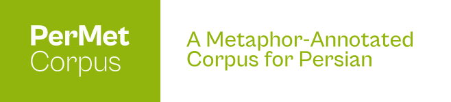

<p align="center">
  
</p>

# PerMet: A Metaphor-Annotated Corpus for Persian
[](https://en.wikipedia.org/wiki/Persian_language)
[](https://creativecommons.org/licenses/by-nc-sa/4.0/deed.en)
[](https://universaldependencies.org/ext-format.html)
[](https://doi.org/10.63317/26xmdq7f998f)

> **⚠️ Note:** The corpus is being finalized and files are undergoing correction. You may use the data, but please note that some non-MRW tags, such as POS/lemma/MWE tags (particularly for the social media subcorpus), are being updated to fix existing errors.

PerMet is register-diverse metaphor-annotated corpus for Persian developed to support corpus-linguistic and NLP research on metaphor. The corpus is annotated following the [Metaphor Identification Procedure Vrije Universiteit (MIPVU)](https://benjamins.com/catalog/celcr.14), with adaptations for Persian. 


## 🔎 Corpus Overview

- **Total size:** ~120,000 tokens
- **Lexical units (LUs):** ~99,000
- **Registers:** Academic, News, Fiction, Social Media, Spoken Discourse
- **Metaphor density:** 13.1% of LUs
- **Inter-annotator agreement:** κ = 0.952


## 📂 Repository Structure

```
PerMet/
├── data/
│   ├── PerMet_v1.0.zip           # Compressed archive (v1.0)
│   └── PerMet_v1.0.tar.gz        # Compressed archive (v1.0)
│       # Archives include 5 registers: academic, fiction, news, social_media, spoken
├── docs/
│   ├── PerMet_logo.svg           # Corpus logo
│   └── 2026.lrec2026-1.379.pdf   # Published paper (LREC 2026)
├── LICENSE                       # CC BY-NC-SA 4.0 Legal Text
└── README.md                     # Project documentation and citation
```


## 📜 License

This work is licensed under Creative Commons Attribution-NonCommercial-ShareAlike 4.0 International. To view a copy of this license, visit https://creativecommons.org/licenses/by-nc-sa/4.0/

* **Attribution:** You must cite our paper if you use this data.
* **Non-Commercial:** You may not use this material for commercial purposes.
* **ShareAlike:** If you remix or adapt this work, you must distribute your contributions under the same license.


## ✍️ Citation

If you use PerMet in your research, please cite:

> Miri, M. S. (2026). Introducing PerMet 1.0: A Metaphor-Annotated Corpus for Persian. In Proceedings of the Fifteenth Language Resources and Evaluation Conference (LREC 2026) (pp. 4835–4845). European Language Resources Association (ELRA). https://doi.org/10.63317/26xmdq7f998f.

### BibTeX

```bibtex
@inproceedings{miri-2026-introducing,
  title = {Introducing PerMet 1.0: A Metaphor-Annotated Corpus for Persian},
  author = {Miri, Mohammad Saeid},
  booktitle = {Proceedings of the Fifteenth Language Resources and Evaluation Conference (LREC 2026)},
  month = {May},
  year = {2026},
  pages = {4835--4845},
  address = {Palma, Mallorca, Spain},
  publisher = {European Language Resources Association (ELRA)},
  doi = {10.63317/26xmdq7f998f},
  abstract = {Metaphor plays a central role in human language and thought, and corpus-linguistic approaches enable its systematic investigation. Such research requires large, representative collections of metaphor-annotated linguistic data from diverse contexts. Despite the increasing availability of metaphor corpora in various languages, Persian remains underrepresented, with few publicly available resources and no large-scale register-diverse metaphor corpus. This paper introduces PerMet 1.0, a metaphor-annotated corpus for Persian. The corpus consists of approximately 120,000 tokens (about 99,000 lexical units) drawn from five registers: academic, news, fiction, social media, and spoken discourse. Five independent annotators labeled the corpus using Metaphor Identification Procedure Vrije Universiteit (MIPVU), with adaptations for Persian. Inter-annotator agreement showed a high level of consistency (κ = 0.952), confirming the reliability of the annotation. Preliminary analysis shows that 13.1% of the lexical units are related to metaphor, with the academic register showing the highest proportion, followed by news, social media, spoken, and fiction. PerMet 1.0 offers a foundational resource for research on metaphor in Persian, cross-linguistic comparative studies, and the development and fine-tuning of machine learning or large language models for automatic metaphor identification.}
}
```

## 📫 Contact

For questions, collaboration, or reporting issues, please open an issue in this repository or contact ms_miri@outlook.com.
